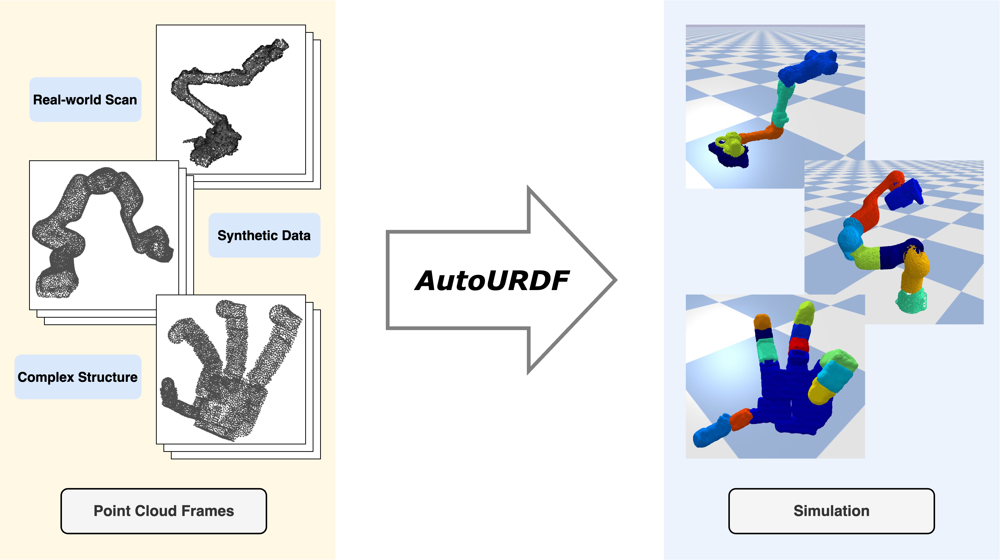

# AutoURDF: Unsupervised Robot Modeling from Point Cloud Frames Using Cluster Registration

## [Project page](https://jl6017.github.io/AutoURDF/) | [Paper](https://arxiv.org/abs/2412.05507)



This repository contains the official implementation associated with the paper "AutoURDF: Unsupervised Robot Modeling from Point Cloud Frames Using Cluster Registration".

<!-- ## Pipeline

 -->

## Run

### Environment

```
conda create -n autourdf python=3.9

conda activate autourdf

pip install torch==2.4.1 torchvision==0.19.1 torchaudio==2.4.1 --index-url https://download.pytorch.org/whl/cu124

pip install -r requirements.txt

```

For pytroch3D installation, please follow this instruction: [pytorch3D installation](https://github.com/facebookresearch/pytorch3d/blob/main/INSTALL.md).


### Data Collection

Collect point cloud sequences, by default wx200_5, 5 sequences
```
bash dataset.sh
```

### Train Registration Model

Registration, by default wx200_5, run 5 sequences
```
bash registration.sh
```

### URDF Results

Output URDF, by default wx200_5, run 1 or 5 sequences, unknown DoF infomation
with 5 sequences, 50 frames
```
python PointCloud/coord_map.py --robot wx200_5 --unknown_dof
```
with only 1 sequence, 10 frames
```
python PointCloud/coord_map.py --robot wx200_5 --end_video 1 --unknown_dof
```


## Acknowledgments

We sincerely thank [Changxi Zheng](https://www.cs.columbia.edu/~cxz/) and [Ruoshi Liu](https://ruoshiliu.github.io/) for their invaluable feedback.


## BibTex

```
@article{lin2024autourdf,
  title={AutoURDF: Unsupervised Robot Modeling from Point Cloud Frames Using Cluster Registration},
  author={Lin, Jiong and Zhang, Lechen and Lee, Kwansoo and Ning, Jialong and Goldfeder, Judah and Lipson, Hod},
  journal={arXiv preprint arXiv:2412.05507},
  year={2024}
}
```